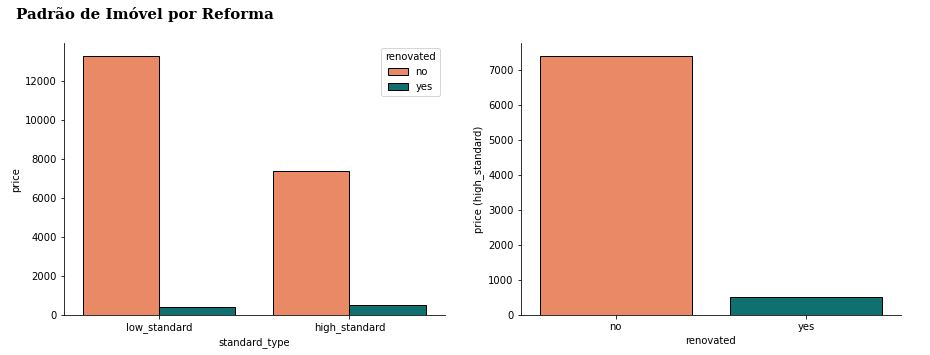
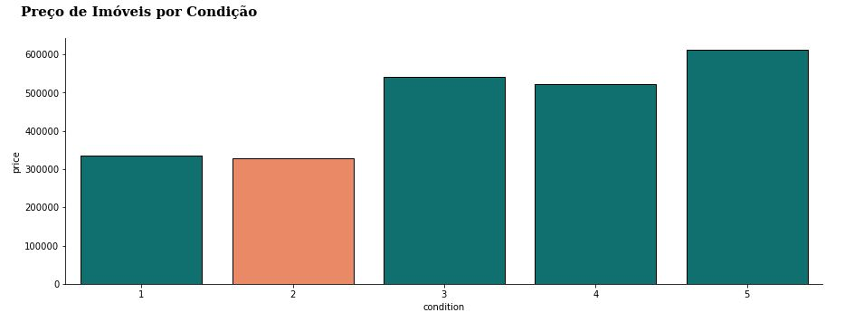
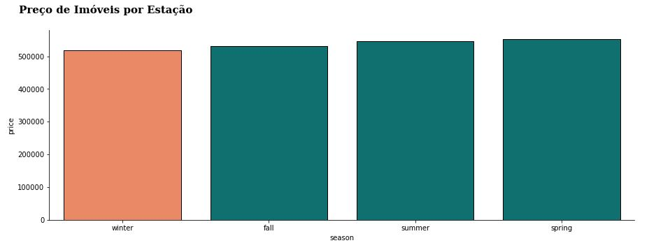

   

# House-Resale-Recommendation

Análise revenda de Imóveis.

  

## Conteúdo

<!--ts-->

1.  [Problema](#Contexto-do-Problema)
2.  [Entendimento do Problema](#Entendimento-do-Problema)
3.  [Dados](#Descricao-dos-Dados)
4.  [Planejamento da Solução](#Planejamento-da-Solução)
5.  [Hipóteses Principais](#Hipoteses-Principais)
6.  [Respondendo Perguntas de Negócio](#Respondendo-Perguntas-de-Negócio)
7.  [Retorno ao Negócio](#Retorno-ao-Negócio)
<!--te-->

# Contexto do Problema

A **House Rocket** é uma plataforma digital que tem como modelo de negócio, a compra e a venda de imóveis usando tecnologia.
Você é um Data Scientist contrato pela empresa para ajudar a encontrar as melhores oportunidades de negócio no mercado de imóveis. O CEO da House Rocket gostaria de maximizar a receita da empresa encontrando boas oportunidades de negócio.
Sua principal estratégia é comprar boas casas em ótimas localizações com preços baixos e depois revendê-las posteriormente à preços mais altos. Quanto maior a diferença entre a compra e a venda, maior o lucro da empresa e portanto maior sua receita.
Entretanto, as casas possuem muitos atributos que as tornam mais ou menos atrativas aos compradores e vendedores e a localização e o período do ano também podem influenciar os preços.

Portanto, seu trabalho como Data Scientist é responder as seguinte perguntas:

1. Quais casas o CEO da House Rocket deveria comprar e por qual preço de compra?

2. Uma vez a casa em posse da empresa, qual o melhor momento para vendê-las e qual seria o preço da venda?

# Entendimento do Problema

#### **Motivação:**

- Encontrar as melhores oportunidades no mercado de imóveis.

#### **Causa Raiz do Problema:**

- Maximizar a receita da empresa encontrando boas oportunidades de negócio.

#### **Formato da Solução:**

- **Tipo de Problema**: Análise.
- **Métodos**: Análise de dados/Insight/EDA
- **Formato da Entrega**: Relatório Excel com as sugestões de compra dos imóveis, valor de compra, hora da venda sugerida e o valor vendido recomendado.

#### **Dados para Resolver o Problema:**

- Os dados estão no Kaggle e podem ser encontrados [aqui](https://www.kaggle.com/shivachandel/kc-house-data).

# Descrição dos Dados

O Dataset usado para este projeto possui 21613 linhas e 21 colunas. Os dados contém:

| Atributo      | Significado                        |
| ------------- | ---------------------------------- |
| id            | identificação do imóvel            |
| date          | data do imóvel para venda          |
| price         | preço do imóvel                    |
| bedrooms      | Nº de quartos                      |
| bathrooms     | Nº de banheiros                    |
| sqft_living   | tipo de metragem do imóvel         |
| sqft_lot      | tipo de metragem do imóvel         |
| floors        | Nº de andar                        |
| waterfront    | se o imóvel possui vista para água |
| view          | vista imóvel                       |
| condition     | consição do imóvel                 |
| grade         | nota do imóvel                     |
| sqft_above    | tipo de metragem do imóvel         |
| sqft_basement | tipo de metragem do porão          |
| yr_built      | ano de construção                  |
| yr_renovated  | ano de reforma                     |
| zipcode       | Região imóvel                      |
| lat           | latitude                           |
| long          | longitude                          |
| sqft_living15 | tipo de metragem do imóvel         |
| sqft_lot15    | tipo de metragem do imóvel         |

# Planejamento da Solução

**1. Coletar os dados:**

- Carregar o conjunto de dados que será utlizado.

**2. Limpar os dados:**

- Entender as variáveis disponíveis
- Verificar possíveis valores faltantes e inconsistências.

**3. Entender os dados:**

- Realizar uma estatística descritiva para entender as características dos dados.

**4. Levantar Hipóteses:**

- Criar Hipóteses sobre as características e o comportamento da satisfação dos passageiros.

**5. Realizar Análise Exploratória de Dados:**

- Validar ou refutar as hipóteses através dos dados.
- Identificar correlação entre variáveis e a variável de preço.
- Obter insights.

**6. Escrever os Insights encontrados:**

- Respponder as perguntas de negócio.
- Entraga da solução
- Demonstrar retorno ao negócio

# Hipóteses Principais

### H5. A maior parte dos imóveis de alto padrão possuem reformas.

**FALSA** A maior parte dos imóveis de alto padrão Não possuem reformas.

  

### H6. Imóveis com condição igual a 1 são mais baratos, na média.

**FALSA** Imóveis com condição igual a 2 são mais baratos, na média.

  

### H11. Imóveis disponíveis para venda no verão são mais baratos, na média.

**FALSA** Imóveis disponíveis para venda no Inverno são mais baratos e na primavera são mais caros, na média.

  

# Respondendo Perguntas de Negócio

### 1. Quais são os imóveis que a House Rocket deveria comprar e por qual preço?

- Eu vou agrupar os dados por região (Zipcode).
- Dentro de cada região, encontrar a mediana do preço dos imóveis.
- Vou seugerir que os imóveis que estão abaixo do preço mediano de cada região e que estejam em boas condições, sejam comprados.

### 2. Uma vez o imóvel comprado, qual o melhor momento para vendê-lo e por qual preço?

- Eu vou agrupar os imóveis por região (Zipcode) e por sazonalidade (Estação do ano).
- Dentro de cada região e sazonalidade, será calculado a mediana de preço.
- Condições de venda:

  - **1.** Se o preço da compra for Maior que a mediana da região + sazonalidade.
    - O preço da venda será igual ao preço da compra + 10%.
  - **2.** Se o preço da compra for Menor que a mediana da região + sazonalidade.
    - O preço da venda será igual ao preço da compra + 30%.

# Retorno ao Negócio

Seguindo as recomendações de compra e venda dos imóveis, a House Rocket irá gastar no total 4.094.212.008,00 de dolares para comprar todos os imóveis recomendados e irá conseguir um lucro bruto total de 4.868.167.042,20 em dolares e um lucro liquido total de U$773.955.034,19 com uma margem de lucro total de 16%.
